# Cowrie Honeypot with Splunk Cloud Integration

This project shares my experience deploying the Cowrie SSH honeypot, progressively increasing its complexity by enabling Telnet functionality and configuring log forwarding to Splunk Cloud for centralized monitoring and analysis.

## **1. Setting up a VPS and the Cowrie Honeypot**

For this project, I chose Hostinger as my provider with a basic Ubuntu Server setup. This was my first time setting up a VPS, but the process turned out to be very user-friendly. I had everything up and running in under 20 minutes.
   
Once I gained access to the machine, following Cowrie’s best practices, I created a dedicated user without sudo privileges to run the honeypot. 
   

   
Then, I used Git to clone the official Cowrie repository:

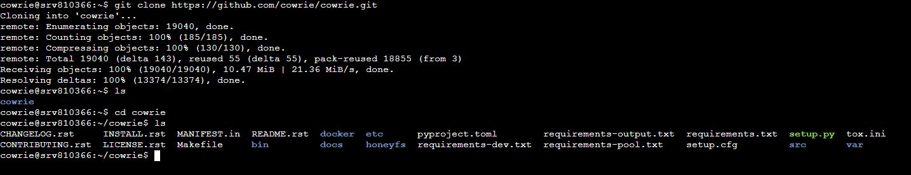
   
I also made some changes to the UFW to ensure that outbound traffic was only allowed to specific ports.

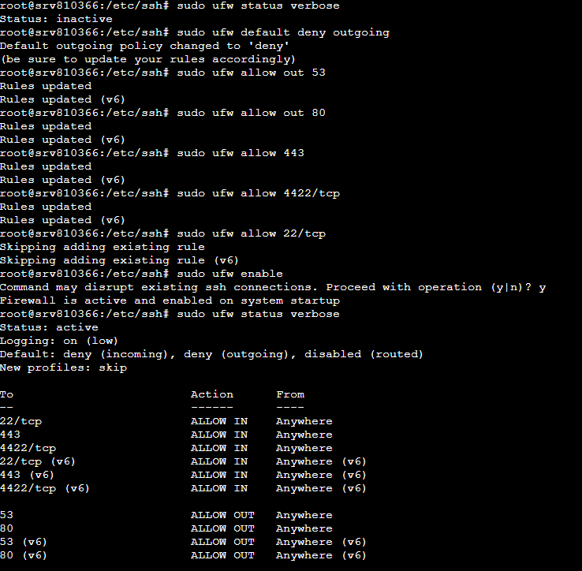
   
After that, I installed Python’s virtual environment and the dependencies required to run the honeypot. These steps are all available in the official documentation: https://docs.cowrie.org/en/latest/INSTALL.html

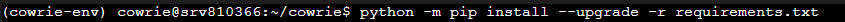

I also made a change to the iptables rules to make sure that incoming traffic on port 22 would be redirected to port 2222 (which Cowrie uses by default to emulate the SSH connection):

`$ sudo iptables -t nat -A PREROUTING -p tcp --dport 22 -j REDIRECT --to-port 2222`

At this point, I tried to start the honeypot, but after some time with no actions, I realized that Hostinger was blocking all incoming traffic by default, so I had to make some changes to the VPS Firewall rules to allow incoming traffic on port 22 and 2222

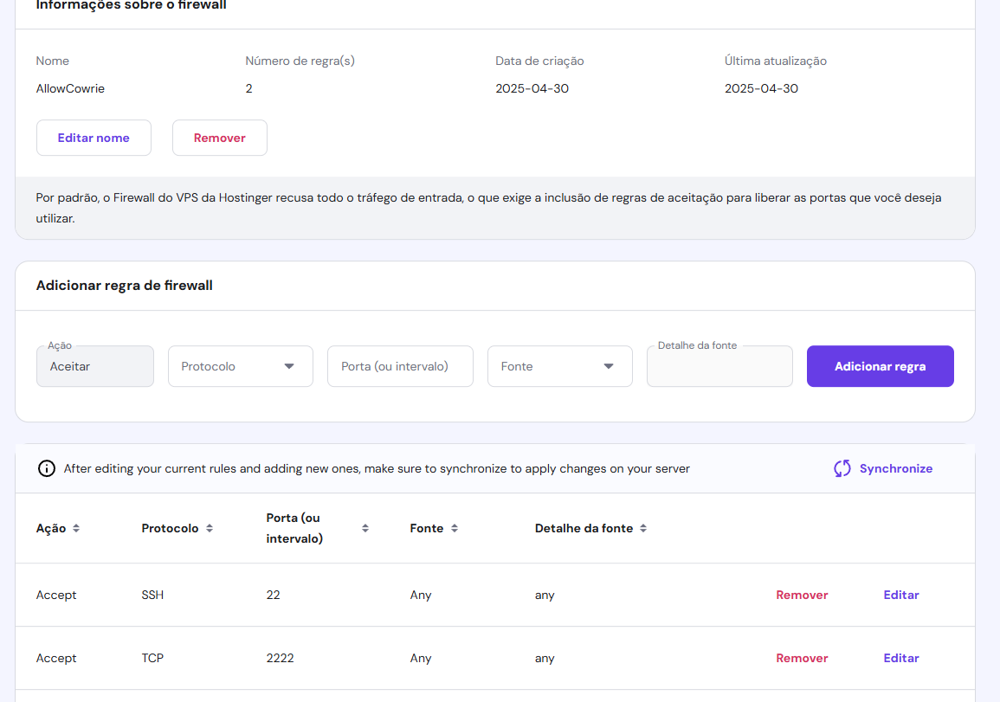

## **2. First Interactions Logged**

**First SSH Auth Attempt**

Shortly after deploying the honeypot, this was the first real interaction my honeypot received. The IP `8.212.178.54` tried to authenticate using a specific public key, but the honeypot detected a structure unpacking error, and the session was dropped. Researching this pattern on Google, I've found out that this is somewhat common on cowrie environments and could be related to malformed packets.

After the first contact, I received two or three hits with the same characteristics, attempts to authenticate using a specific public key, all unsuccessful.

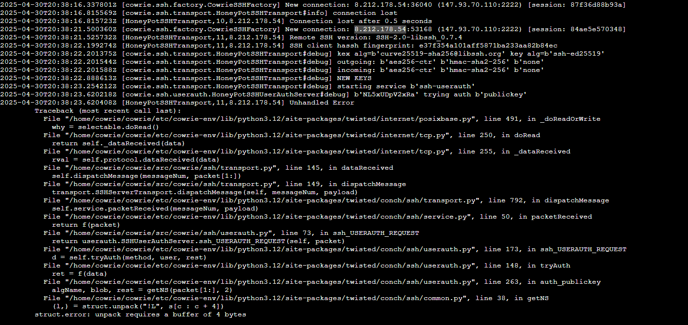

I then decided to expand the attack surface by enabling the Telnet protocol in Cowrie's configuration files. Since Telnet is commonly targeted by IoT botnets, I enabled it to increase the honeypot's visibility and attract more interactions.

Naturally, as Cowrie uses port 2222 to mimic SSH, it does the same for Telnet on port 2223, and adding rules to redirect traffic from port 23 to 2223 is also recommended.

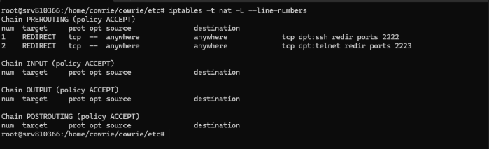

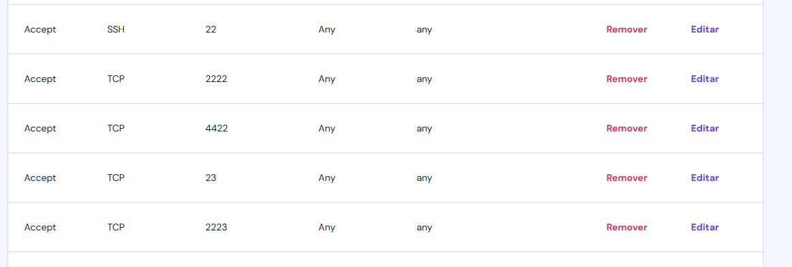

Shortly after enabling the Telnet protocol, we started getting more hits with interesting patterns.

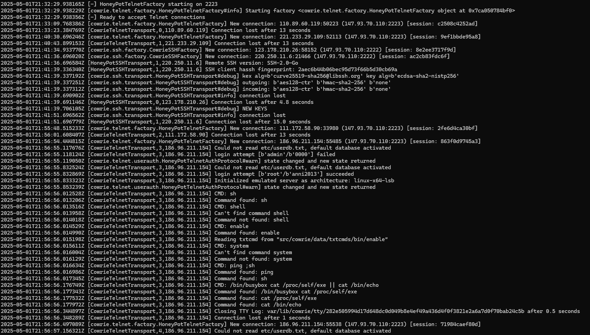
   
It worked surprisingly well and 20 minutes later we logged a command interaction that indicated a botnet behavior. They attempted to spawn a shell, escalate privileges using typical router/IoT commands, and executed tests to detect the system’s environment by reading `/proc/self/exe.` 

On that same day we also logged a very interesting interaction from the IP: `186.96.211.154`. I observed it repeating the `rm -rf .a` command across many folders to remove files created by other malwares, a common practice for botnets who compete for the control of the device.

The attacker also used a series of `echo -e` commands with hexadecimal strings to reconstruct a binary payload directly on the system. These `echo -e` commands are used for obfuscating the payload and building it piece by piece directly on the compromised machine, avoiding Firewalls or other detection methods.

Cowrie captured the payload and saved it with the hash `446c26d35cac3ecb54c860fd7c1ed3c51f1ca609b99c772f61a3615a1e31868b`

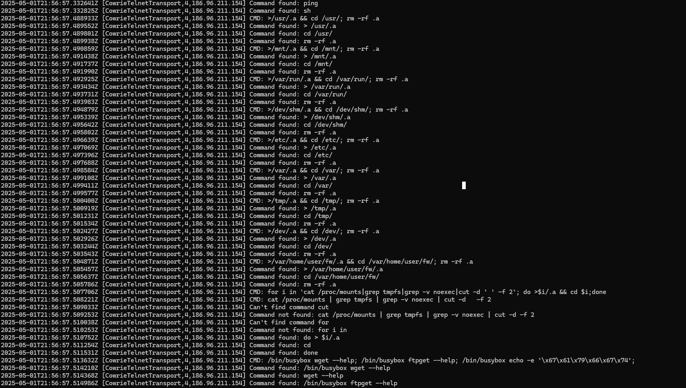
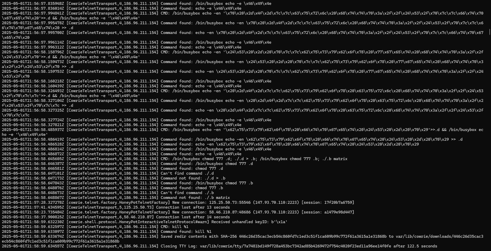

Searching for the hash on VirusTotal, I also found some comments regarding others detecting the same hash from their honeypots

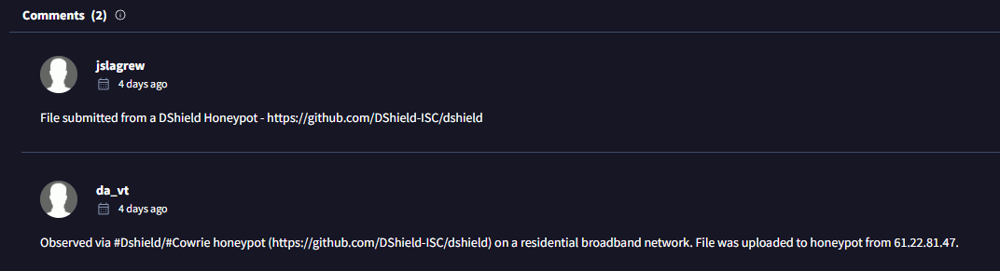

After this interaction,  I decided to leave the Honeypot running for a few days, and almost all interactions were IoT botnets trying to interact with busybox and gain control of the device or other brute-force SSH interactions. 

The majority of attempted payloads were unsuccessful since I blocked outbound traffic (maybe too harshly). In the future, I will probably loosen restrictions to observe more detailed interactions with these botnets and possibly capture more payloads.

## **3. Setting up Splunk Cloud**

For the next step of the project, it naturally went in the direction of finding a better way to present all of the data, so I've changed an option on the `cowrie.conf` file where we can send the logs to *Splunk Cloud* using an HTTPS Token, which is exactly what I did!

Cowrie already stores logs both in the raw format, as shown in the previous screenshots, but also on a .json file which is perfect for presenting the data on Splunk

This is how the log .json looks for each event on the Splunk Cloud:

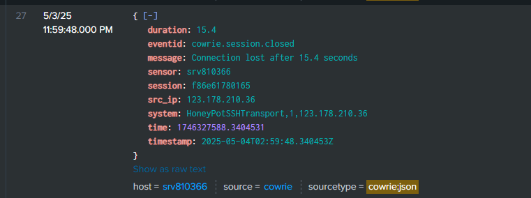

I've also uploaded older logs to Splunk manually and created a Dashboard presenting the experiment data in a more user-friendly way

Total Connections and Top Attacking IPs:

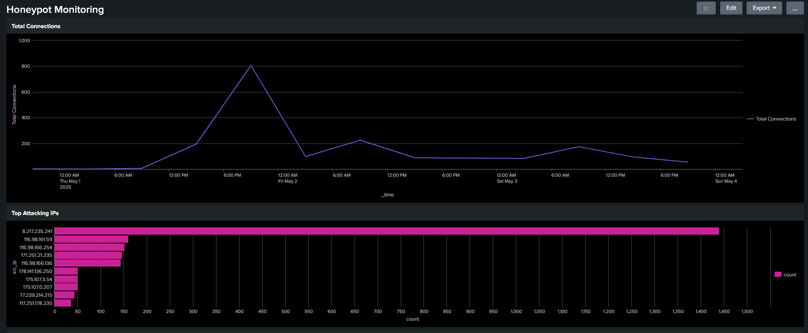

Sessions by Protocol and Top Commands Issued:

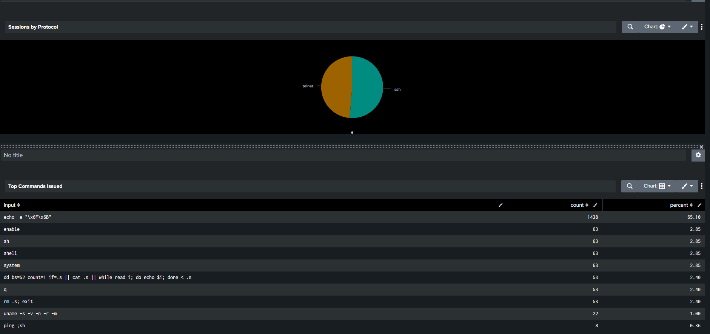

Top Targeted Usernames and Top Targeted Passwords:

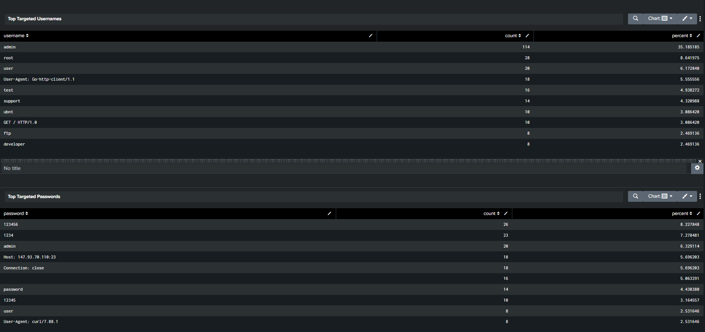

## **Conclusion**

For this brief experiment, it's safe to say that most, if not all, of the attacks were automated by botnets or scripts. Reviewing the data from the dashboard, the most frequent command was `echo -e "\x6F\x6B"`, which translates to "OK". This was probably used to signal back to a C2 server that the device was ready to receive a payload, or maybe as a simple marker inside the script itself.

Other commands focused on reconnaissance and persistence. Some were trying to remove other malware with `rm -rf .a`, and others were reading files like `/proc/self/exe` to gather information about the system. This shows how competitive the environment is, with different botnets racing to control exposed devices before someone else does.

The attacks were fast, simple, and clearly automated, prioritizing speed and coverage over stealth or complexity.

Overall, this experiment shows how valuable honeypots can be. They help you capture these behaviors and understand how real attackers operate. Beyond detection, they’re great tools for research and learning more about current threats.

*All raw logs from May 1st to May 4th are available in the project folder.*
